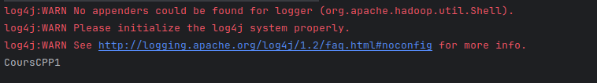

# Java API for Interacting with Hadoop Distributed File System (HDFS) 
## Introduction
A Java API for interacting with the Hadoop Distributed File System (HDFS). This API facilitates reading and writing data in HDFS. The first part of the project focuses on writing data to an HDFS file using the Java API. In the second part, an application is developed to read a file from HDFS and rewrite it in the local file system. This repository aims to offer a set of examples and functionalities for developers to seamlessly integrate HDFS into their Java applications.

## Maven Dependencies
```xml
<dependency>
    <groupId>org.apache.hadoop</groupId>
    <artifactId>hadoop-client</artifactId>
    <version>2.7.3</version>
</dependency>
```

## Reading from HDFS in Java

### Java Code

```java
public class Read {
    public static void main() {
        Configuration cf = new Configuration();
        cf.set("fs.defaultFS", "hdfs://localhost:9000");
        FileSystem fileSystem = FileSystem.get(cf);
        Path path = new Path("/BDDC/CPP/Cours/CoursCPP1");
        FSDataInputStream fsdis = fileSystem.open(path);
        BufferedReader reader = new BufferedReader(new InputStreamReader(fsdis, StandardCharsets.UTF_8));
        String ligne = null;
        while ((ligne = reader.readLine()) != null) {
            System.out.println(ligne);
        }
        fsdis.close();
        fileSystem.close();
    }
}
```

### Results


## Writing To HDFS in Java

### Code Java
```java
public class Write {
    public static void main(String[] args) throws IOException {
        Configuration configuration = new Configuration();
        configuration.set("fs.defaultFS", "hdfs://localhost:9000");
        FileSystem fs = FileSystem.get(configuration);
        Path path = new Path("/BDDC/CPP/Cours/CoursCPP1");
        FSDataOutputStream fsdos = fs.create(path);
        BufferedWriter br = new BufferedWriter(new OutputStreamWriter(fsdos, StandardCharsets.UTF_8));
        br.write("BDDC 2");
        br.newLine();
        br.write("BDDC 2");
        br.close();
        fs.close();
    }
}
```